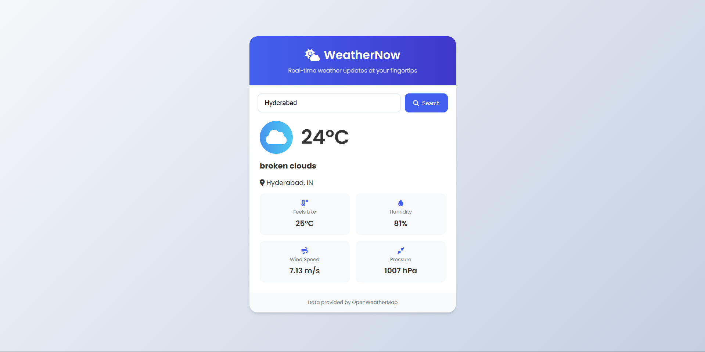

# WeatherNow ☁️🌤️

A simple and clean weather application that displays real-time weather information for any city using the OpenWeatherMap API.

---

## 🚀 Features

- Search any city’s weather
- Live temperature and weather conditions
- Responsive design

---

## 🛠 Tech Stack

- HTML
- CSS
- JavaScript
- OpenWeatherMap API

---

## ⚙️ Setup Instructions

1. Clone the repo  
   `git clone https://github.com/saikrishna21201/WeatherNow.git`

2. Open `index.html` in your browser

---

## 🔑 API Key Info

This project uses a free OpenWeatherMap API key embedded directly in the JS file.  
This is fine for demo purposes, but **don’t expose your key** in production apps.

---

## 📸 Screenshot

> Replace this with an actual screenshot

---

## 📄 License

This project is licensed under the [MIT License](https://github.com/saikrishna21201/WeatherNow/blob/main/LICENSE).

---

## 🙋‍♂️ Author

**Saikrishna Addagudi**  
GitHub: [@saikrishna21201](https://github.com/saikrishna21201)
